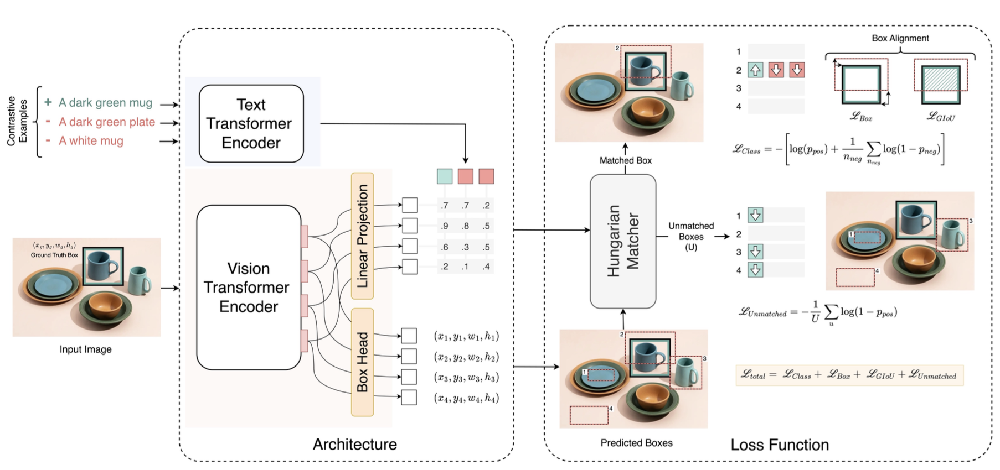

# Multi-modal Zero-shot Object Detection in Egocentric Videos &middot; []([https://github.com/your/your-project/blob/master/LICENSE](https://github.com/sharad5/OWL-ViT-Object-Detection/blob/main/LICENSE)https://github.com/sharad5/OWL-ViT-Object-Detection/blob/main/LICENSE)


**Problem**: Zero-shot instance detection by determining the bounding box for a specific object instance based on a provided "query" describing that instance. In this context, a level-k (Lk) query is defined as a description of an object instance using k attributes and/or parts. For instance, queries like "blue mug" or "mug with a blue handle" fall under L1, while "blue striped mug with a white handle" is categorized as an L3 query. Each query is linked to one positive image accompanied by a bounding box and a distractor set, consisting of up to 100 hard negative images. We use the Average Recall at k (AR@k), to evaluate the performance of a model on this task.

This Project is built to finetune and use Google's [OWL ViT (2022)](https://arxiv.org/pdf/2205.06230.pdf) for referring expression object detection tasks for egocentric videos. 

## Training/Finetuning Procedure 
The pre-trained model checkpoint from hugging-face is trained on COCO images and other image-text pairs, with the object name as the query. For this, problem we finetune this model to work with actual queries of varying levels of descriptions (L1, L2, and L3). To achieve this, we modify the loss term to facilitate contrastive learning by creating positive and negative queries for each image. We also add loss terms to suppress the positive-class probabilities for the irrelevant detected boxes. The image below demonstrates this clearly:



## Usage

**Config File Update**: Update `config.py` as required

**Training Script**
```shell
python main.py
```

**Inference Script**
```shell
python inference.py
```

**Capstone Project Report**: [Report](https://github.com/sharad5/OWL-ViT-Object-Detection/blob/main/Capstone_Final_Report.pdf)
**Capstone Project Poster**: [Poster](https://github.com/sharad5/OWL-ViT-Object-Detection/blob/main/CapstonePoster.pdf)

### Team Members

|Name     |  Github   | 
|---------|-----------------|
|[Sargun Nagpal](https://www.linkedin.com/in/sargun-nagpal/)|  [sargun-nagpal](https://github.com/sargun-nagpal)       |
|[Harsha Koneru](https://www.linkedin.com/in/harshakoneru/) |  [harshakoneru](https://github.com/harshakoneru)    |
|[Sharad Dargan](https://www.linkedin.com/in/sharaddargan/) |  [sharaddargan](https://github.com/sharad5)    |
